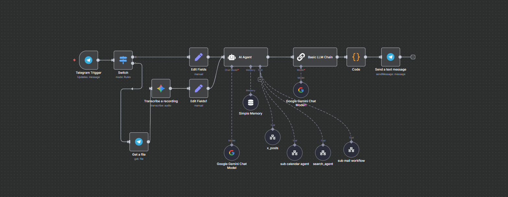
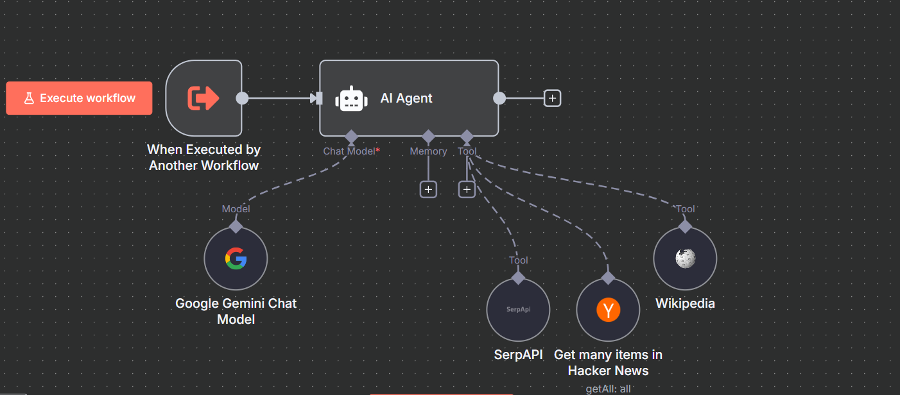
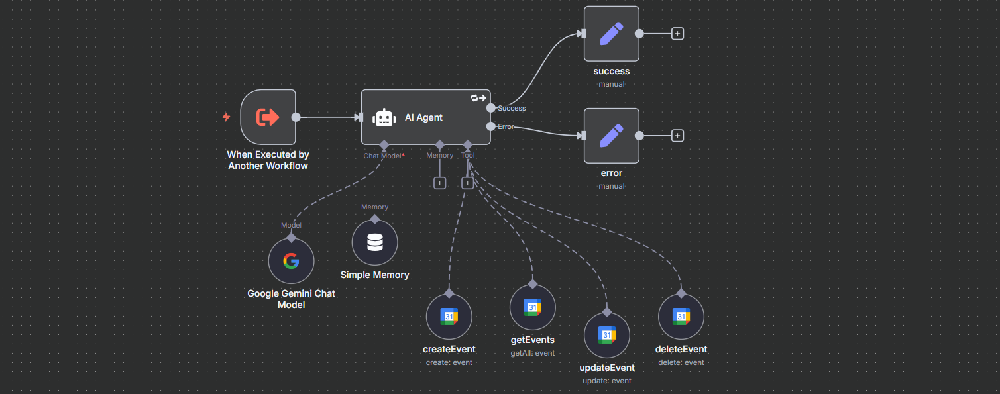
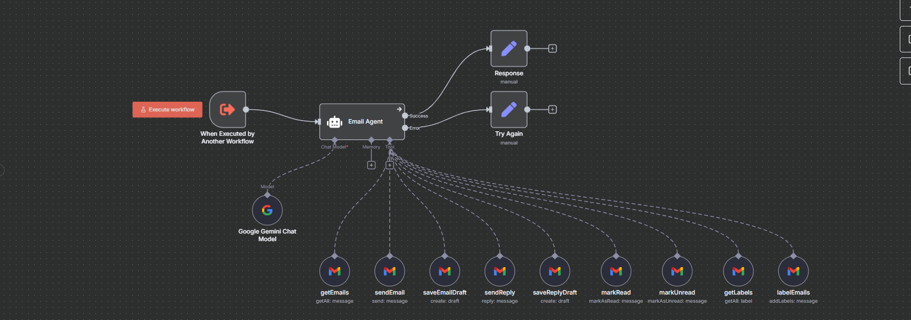

# Advanced Telegram n8n Bot — Modular Sub-Workflows 🤖

A production-ready **Telegram bot** built with **n8n** that routes user intents to **specialized sub-workflows** (agents) such as **News/Search**, **Calendar**, **Mail**, and **Posts → Google Sheets**. The design emphasizes **clear orchestration**, **strong separation of concerns**, and **easy extension**.

---

## 🗺️ High-Level Flow

1. **Telegram Trigger** receives a message from your bot.
2. **Main Orchestrator** parses the text/command and decides which agent to call.
3. **Execute Workflow** nodes invoke **sub-workflows** (news, calendar, mail, posts).
4. Each agent does its job (API calls, transforms, logging), returns a result.
5. The **Main Orchestrator** replies back to the user in Telegram.

**Architecture overview:**

---

## 📦 Repository Layout

---

## 🧭 How It Works (Step-by-Step with Screenshots)

### 1) Main Orchestrator — `tg advanced.json`
- **Input:** Telegram message (text/commands like `/news`, `/calendar`, `/mail`, `/post`).
- **Logic:** Parses intent (Switch/If/Regex) and sends a payload to the target **sub-workflow** via **Execute Workflow**.
- **Output:** Receives each agent’s response and **sends a Telegram reply**.

> See the overview diagram above for the end-to-end routing.
  
---

### 2) News / Search Agent — `tg subworkflow news.json`
- **Goal:** Handle news/search queries and return concise answers (optionally with sources).
- **Typical nodes:** Text parsing → HTTP/API request (News/Serp) → format summary → return to parent.
- 
**Screenshot:**

---

### 3) Calendar Agent — `sub calendar agent.json`
- **Goal:** Create/find calendar events (e.g., “schedule design sync tomorrow 3pm”).
- **Typical nodes:** Extract title/date/time → Google Calendar (Create/Update/Find) → format confirmation.

**Screenshot:**

---

### 4) Mail Agent — `sub mail workflow.json`
- **Goal:** Send emails (confirmations, summaries, alerts).
- **Typical nodes:** Compose subject/body → Gmail/SMTP node → capture status.

**Screenshot:**

---

### 5) Posts → Google Sheets Agent — `x_posts.json`
- **Goal:** Accept or generate content (e.g., social copy) and **log it to Google Sheets** (content calendar).
- **Typical nodes:** Input/post text → transform (optional) → Google Sheets (Append).

**Screenshot:**

---

## ⚙️ Setup & Configuration

### Prerequisites
- A running **n8n** instance (self-hosted or cloud).
- **Public HTTPS URL** for webhooks (required by Telegram).
- **Telegram Bot Token** from **@BotFather**.
- Optional integrations depending on the agents you plan to use:
  - **Google Calendar** (OAuth) for the Calendar agent.
  - **Gmail (OAuth)** or **SMTP** for the Mail agent.
  - **Google Sheets** (OAuth) for the Posts agent.
  - **News/Search API** (e.g., NewsAPI/Serp API) for the News agent.

### Import Order (recommended)
1. `sub calendar agent.json`  
2. `sub mail workflow.json`  
3. `tg subworkflow news.json`  
4. `x_posts.json`  
5. `tg advanced.json` 

### Credentials
Create/select credentials for:
- **Telegram**: Bot token in **Telegram Trigger** and **Telegram** (Send) nodes.
- **Google**: Calendar / Sheets OAuth (enable the scopes you need).
- **Email**: Gmail OAuth or SMTP (host, port, user, password).
- **News/Search**: API key in the HTTP Request node (or dedicated integration node).

## 🛠️ Extending the System

- **Add a new agent**  
  1) Create a new sub-workflow (`sub my new agent.json`).  
  2) Define inputs/outputs clearly (keep a consistent data shape).  
  3) In **`tg advanced.json`**, add routing logic and an **Execute Workflow** node pointing to it.

- **Harden prompts & parsing**  
  - Normalize commands (lowercase/trim) and pattern-match early.  
  - Validate required fields (e.g., dates, emails) before calling APIs.  
  - Add error branches → user-friendly Telegram messages.

- **Observability**  
  - Add logging (e.g., to Sheets/DB) for intent, duration, and status.  
  - Add retries/timeouts for external APIs.

---

## ❗ Troubleshooting

- **Telegram messages not arriving**
  - Ensure your n8n instance is reachable via **HTTPS** and your **Telegram Trigger** is active.
  - Verify the webhook URL registered by n8n (or set `WEBHOOK_URL` and restart).

- **Execute Workflow not finding sub-workflow**
  - Import **sub-workflows first**.  
  - Open **`tg advanced.json`** and re-select the target workflow by name/ID.

- **Google API errors**
  - Recheck OAuth credentials and scopes.  
  - Ensure the right Google account is connected in the credential.

- **Sheets row not appending**
  - Confirm spreadsheet ID/sheet name and that the credential has write access.  
  - Check for headers/columns matching your Append node configuration.

---

## 📄 License

MIT — feel free to use and adapt.

---

## 👤 Author

**Nathe (Natnael Mulugeta)**  
- Upwork: https://www.upwork.com/freelancers/~019f47e60d13168603  
- Email: natnaelm552@gmail.com

